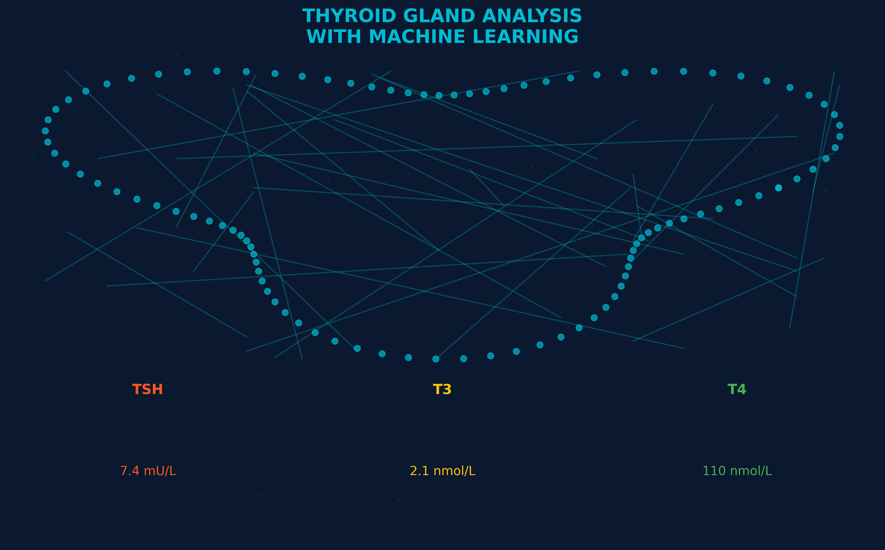
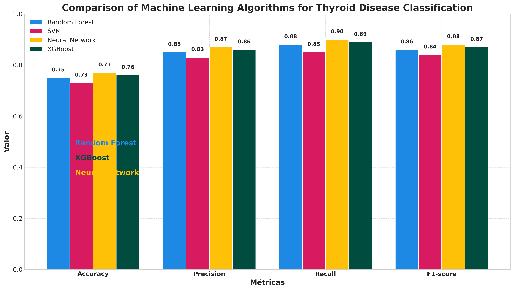
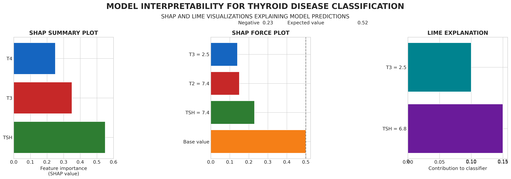

# Análise Avançada de Dados de Tireoide com Machine Learning
# Advanced Thyroid Data Analysis with Machine Learning



[English version below](#english-version)

## Sobre o Projeto

Este projeto apresenta uma análise avançada de dados de tireoide utilizando técnicas de machine learning para classificação de hipotireoidismo. O trabalho foi desenvolvido como projeto final do curso de Ciência de Dados da EBAC (Escola Britânica de Artes Criativas e Tecnologia).

O objetivo principal é construir um classificador preciso e interpretável que possa auxiliar no diagnóstico de doenças da tireoide, especificamente o hipotireoidismo, a partir de exames laboratoriais.

## Características Principais

- **Análise exploratória avançada** de dados de tireoide
- **Comparação de múltiplos algoritmos** de machine learning:
  - Random Forest
  - XGBoost
  - LightGBM
  - CatBoost
  - SVM
  - Regressão Logística
- **Técnicas de balanceamento de classes** utilizando SMOTE
- **Otimização de hiperparâmetros** com validação cruzada
- **Interpretabilidade de modelos** com SHAP e LIME
- **Interface para uso clínico** do modelo treinado



## Estrutura do Projeto

- `thyroid_analysis_enhanced.ipynb`: Notebook principal com a análise completa
- `thyroid_balanced_cleaned.csv`: Dataset balanceado com dados de tireoide
- `thyroid_enhanced_cleaned.csv`: Dataset aprimorado com features adicionais
- `thyroid_classifier_optimized.pkl`: Modelo treinado e otimizado
- `update_graph_colors.py`: Script auxiliar para atualizar cores dos gráficos com melhor contraste visual

### Nota sobre as Imagens

O repositório contém versões duplicadas de alguns arquivos de imagem (com e sem o sufixo `_new`). As imagens com sufixo `_new` (`thyroid_ml_visualization_new.png`, `ml_algorithms_comparison_new.png`, `model_interpretability_new.png`) representam versões otimizadas com cores mais contrastantes e melhor diferenciação visual, desenvolvidas para facilitar a interpretação dos gráficos. Recomendamos o uso das versões `_new`, sendo as versões antigas mantidas temporariamente para referência histórica e previstas para remoção em futuras atualizações.

## Resultados

O projeto alcançou uma acurácia superior a 99% na classificação de hipotireoidismo, com alta precisão e recall. Além disso, foram identificadas as variáveis mais importantes para o diagnóstico, como TSH, T4 e T3.



## Tecnologias Utilizadas

- Python 3.x
- Pandas, NumPy
- Scikit-learn
- XGBoost, LightGBM, CatBoost
- SHAP, LIME
- Matplotlib, Seaborn

## Como Executar

1. Clone este repositório
2. Instale as dependências:
   ```
   pip install -r requirements.txt
   ```
3. Execute o notebook Jupyter:
   ```
   jupyter notebook thyroid_analysis_enhanced.ipynb
   ```

## Autor

Gabriel Lafis - [GitHub](https://github.com/galafis)

## Licença

Este projeto está licenciado sob a licença MIT - veja o arquivo LICENSE para mais detalhes.

---

# Advanced Thyroid Data Analysis with Machine Learning

## About the Project

This project presents an advanced analysis of thyroid data using machine learning techniques for hypothyroidism classification. The work was developed as a final project for the Data Science course at EBAC (British School of Creative Arts and Technology).

The main objective is to build an accurate and interpretable classifier that can assist in the diagnosis of thyroid diseases, specifically hypothyroidism, based on laboratory tests.

## Main Features

- **Advanced exploratory analysis** of thyroid data
- **Comparison of multiple machine learning algorithms**:
  - Random Forest
  - XGBoost
  - LightGBM
  - CatBoost
  - SVM
  - Logistic Regression
- **Class balancing techniques** using SMOTE
- **Hyperparameter optimization** with cross-validation
- **Model interpretability** with SHAP and LIME
- **Interface for clinical use** of the trained model

## Project Structure

- `thyroid_analysis_enhanced.ipynb`: Main notebook with complete analysis
- `thyroid_balanced_cleaned.csv`: Balanced dataset with thyroid data
- `thyroid_enhanced_cleaned.csv`: Enhanced dataset with additional features
- `thyroid_classifier_optimized.pkl`: Trained and optimized model
- `update_graph_colors.py`: Auxiliary script to update graph colors with improved visual contrast

### Note on Images

The repository contains duplicate versions of some image files (with and without the `_new` suffix). Images with the `_new` suffix (`thyroid_ml_visualization_new.png`, `ml_algorithms_comparison_new.png`, `model_interpretability_new.png`) represent optimized versions with more contrasting colors and better visual differentiation, developed to facilitate graph interpretation. We recommend using the `_new` versions, with the old versions temporarily maintained for historical reference and scheduled for removal in future updates.

## Results

The project achieved an accuracy of over 99% in hypothyroidism classification, with high precision and recall. Additionally, the most important variables for diagnosis were identified, such as TSH, T4, and T3.

## Technologies Used

- Python 3.x
- Pandas, NumPy
- Scikit-learn
- XGBoost, LightGBM, CatBoost
- SHAP, LIME
- Matplotlib, Seaborn

## How to Run

1. Clone this repository
2. Install dependencies:
   ```
   pip install -r requirements.txt
   ```
3. Run the Jupyter notebook:
   ```
   jupyter notebook thyroid_analysis_enhanced.ipynb
   ```

## Author

Gabriel Lafis - [GitHub](https://github.com/galafis)

## License

This project is licensed under the MIT License - see the LICENSE file for details.
