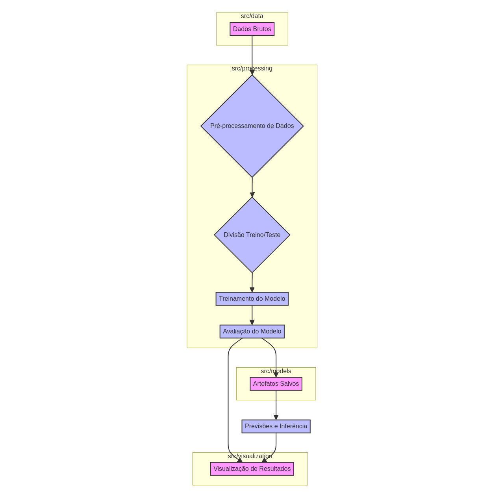

# Análise da Glândula Tireoide com Machine Learning


[](https://opensource.org/licenses/MIT)
[](https://www.python.org/)
[](https://pypi.org/)
[](https://github.com/GabrielDemetriosLafis/thyroid-analysis/actions/workflows/python-test.yml)

## Visão Geral do Projeto

Este repositório apresenta um estudo abrangente sobre a **análise da glândula tireoide utilizando técnicas de Machine Learning**. O objetivo principal é desenvolver e comparar modelos preditivos para a classificação de doenças da tireoide, bem como explorar a interpretabilidade desses modelos para entender os fatores que influenciam suas decisões. O projeto inclui pré-processamento de dados, treinamento de diversos algoritmos de ML e visualizações detalhadas dos resultados e da interpretabilidade do modelo.

## Estrutura do Repositório

A estrutura do repositório foi organizada para facilitar a navegação e a compreensão do projeto:

```
thyroid-analysis/
├── config/                 # Arquivos de configuração e dependências
│   └── requirements.txt    # Dependências do projeto
├── docs/                   # Documentação adicional, imagens e diagramas
│   ├── images/             # Imagens e gráficos gerados
│   │   ├── architecture_diagram.png
│   │   ├── ml_algorithms_comparison_new.png
│   │   ├── model_interpretability_new.png
│   │   └── thyroid_ml_visualization_new.png
│   └── architecture_diagram.md # Diagrama de arquitetura em Mermaid
├── src/                    # Código fonte do projeto
│   ├── data/               # Conjuntos de dados utilizados
│   │   ├── thyroid_balanced_cleaned.csv
│   │   └── thyroid_enhanced_cleaned.csv
│   └── update_graph_colors.py # Script para geração e atualização de gráficos
├── tests/                  # Testes unitários
│   └── test_update_graph_colors.py # Testes para o script de gráficos
├── .gitignore              # Arquivos e diretórios a serem ignorados pelo Git
├── LICENSE                 # Informações de licenciamento do projeto
└── README.md               # Este arquivo (documentação principal)
```

## Diagrama de Arquitetura

O diagrama abaixo ilustra a arquitetura geral do projeto, desde a ingestão de dados até a visualização dos resultados e a interpretabilidade dos modelos.



## Tecnologias Utilizadas

*   **Python 3.11+**
*   **Bibliotecas de Data Science:** `Numpy`, `Pandas`, `Matplotlib`, `Seaborn`, `Scikit-learn`, `Imbalanced-learn`
*   **Modelos de Machine Learning:** `XGBoost`, `LightGBM`, `CatBoost`
*   **Interpretabilidade de Modelos:** `SHAP`, `LIME`
*   **Visualização:** `Matplotlib`, `Seaborn`, `Mermaid`

## Como Executar o Projeto

Para configurar e executar este projeto localmente, siga os passos abaixo:

### 1. Clonar o Repositório

```bash
git clone https://github.com/GabrielDemetriosLafis/thyroid-analysis.git
cd thyroid-analysis
```

### 2. Instalar Dependências

É altamente recomendável usar um ambiente virtual para gerenciar as dependências:

```bash
python3 -m venv venv
source venv/bin/activate  # No Windows: .\venv\Scripts\activate
pip install -r config/requirements.txt
```

### 3. Gerar Gráficos

O script `update_graph_colors.py` gera os gráficos de comparação de algoritmos, interpretabilidade e visualização ML. Para executá-lo:

```bash
python3 src/update_graph_colors.py
```

Os gráficos gerados serão salvos na pasta `docs/images/`.

### 4. Executar Testes

Para garantir a funcionalidade do script de geração de gráficos, execute os testes unitários:

```bash
python3 -m unittest tests/test_update_graph_colors.py
```

## Contribuição

Contribuições são bem-vindas! Por favor, leia o arquivo `CONTRIBUTING.md` para mais detalhes sobre como contribuir.

## Licença

Este projeto está licenciado sob a Licença MIT. Consulte o arquivo `LICENSE` para mais detalhes.

## Autor

**Gabriel Demetrios Lafis**

---

# Thyroid Gland Analysis with Machine Learning


[](https://opensource.org/licenses/MIT)
[](https://www.python.org/)
[](https://pypi.org/)
[](https://github.com/GabrielDemetriosLafis/thyroid-analysis/actions/workflows/python-test.yml)

## Project Overview

This repository presents a comprehensive study on **thyroid gland analysis using Machine Learning techniques**. The main objective is to develop and compare predictive models for thyroid disease classification, as well as to explore the interpretability of these models to understand the factors influencing their decisions. The project includes data preprocessing, training of various ML algorithms, and detailed visualizations of results and model interpretability.

## Repository Structure

The repository structure has been organized to facilitate navigation and understanding of the project:

```
thyroid-analysis/
├── config/                 # Configuration files and dependencies
│   └── requirements.txt    # Project dependencies
├── docs/                   # Additional documentation, images, and diagrams
│   ├── images/             # Generated images and graphs
│   │   ├── architecture_diagram.png
│   │   ├── ml_algorithms_comparison_new.png
│   │   ├── model_interpretability_new.png
│   │   └── thyroid_ml_visualization_new.png
│   └── architecture_diagram.md # Architecture diagram in Mermaid
├── src/                    # Project source code
│   ├── data/               # Datasets used
│   │   ├── thyroid_balanced_cleaned.csv
│   │   └── thyroid_enhanced_cleaned.csv
│   └── update_graph_colors.py # Script for generating and updating graphs
├── tests/                  # Unit tests
│   └── test_update_graph_colors.py # Tests for the graph generation script
├── .gitignore              # Files and directories to be ignored by Git
├── LICENSE                 # Project licensing information
└── README.md               # This file (main documentation)
```

## Architecture Diagram

The diagram below illustrates the overall project architecture, from data ingestion to results visualization and model interpretability.


## Technologies Used

*   **Python 3.11+**
*   **Data Science Libraries:** `Numpy`, `Pandas`, `Matplotlib`, `Seaborn`, `Scikit-learn`, `Imbalanced-learn`
*   **Machine Learning Models:** `XGBoost`, `LightGBM`, `CatBoost`
*   **Model Interpretability:** `SHAP`, `LIME`
*   **Visualization:** `Matplotlib`, `Seaborn`, `Mermaid`

## How to Run the Project

To set up and run this project locally, follow the steps below:

### 1. Clone the Repository

```bash
git clone https://github.com/GabrielDemetriosLafis/thyroid-analysis.git
cd thyroid-analysis
```

### 2. Install Dependencies

It is highly recommended to use a virtual environment to manage dependencies:

```bash
python3 -m venv venv
source venv/bin/activate  # On Windows: .\venv\Scripts\activate
pip install -r config/requirements.txt
```

### 3. Generate Graphs

The `update_graph_colors.py` script generates the algorithm comparison, interpretability, and ML visualization graphs. To run it:

```bash
python3 src/update_graph_colors.py
```

The generated graphs will be saved in the `docs/images/` folder.

### 4. Run Tests

To ensure the functionality of the graph generation script, run the unit tests:

```bash
python3 -m unittest tests/test_update_graph_colors.py
```

## Contribution

Contributions are welcome! Please read the `CONTRIBUTING.md` file for more details on how to contribute.

## License

This project is licensed under the MIT License. See the `LICENSE` file for more details.

## Author

**Gabriel Demetrios Lafis**

