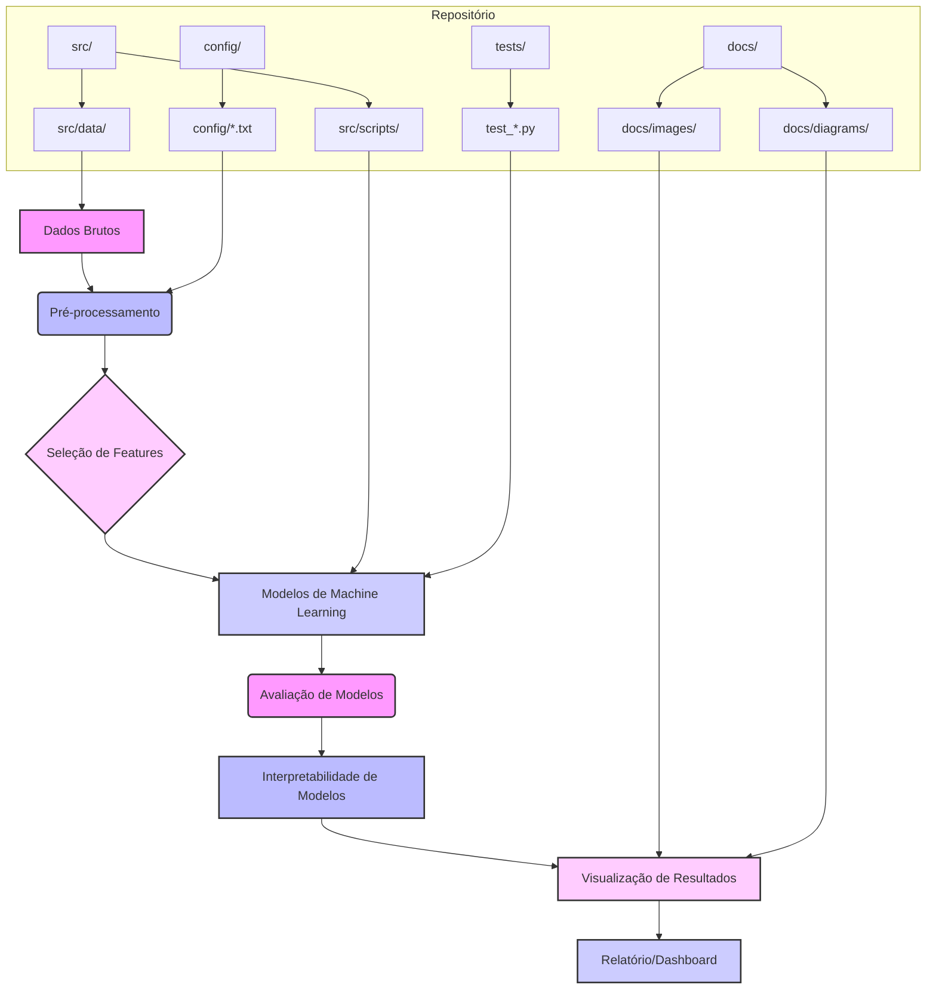

```mermaid
graph TD
    A[Dados Brutos] --> B(Pré-processamento)
    B --> C{Seleção de Features}
    C --> D[Modelos de Machine Learning]
    D --> E(Avaliação de Modelos)
    E --> F[Interpretabilidade de Modelos]
    F --> G[Visualização de Resultados]
    G --> H[Relatório/Dashboard]

    subgraph Repositório
        direction LR
        src[src/] --> src_data[src/data/]
        src --> src_scripts[src/scripts/]
        tests[tests/] --> test_files[test_*.py]
        docs[docs/] --> docs_images[docs/images/]
        docs --> docs_diagrams[docs/diagrams/]
        config[config/] --> config_files[config/*.txt]
    end

    src_data --> A
    src_scripts --> D
    test_files --> D
    docs_images --> G
    docs_diagrams --> G
    config_files --> B

    style A fill:#f9f,stroke:#333,stroke-width:2px
    style B fill:#bbf,stroke:#333,stroke-width:2px
    style C fill:#fcf,stroke:#333,stroke-width:2px
    style D fill:#ccf,stroke:#333,stroke-width:2px
    style E fill:#f9f,stroke:#333,stroke-width:2px
    style F fill:#bbf,stroke:#333,stroke-width:2px
    style G fill:#fcf,stroke:#333,stroke-width:2px
    style H fill:#ccf,stroke:#333,stroke-width:2px
```
```
```

