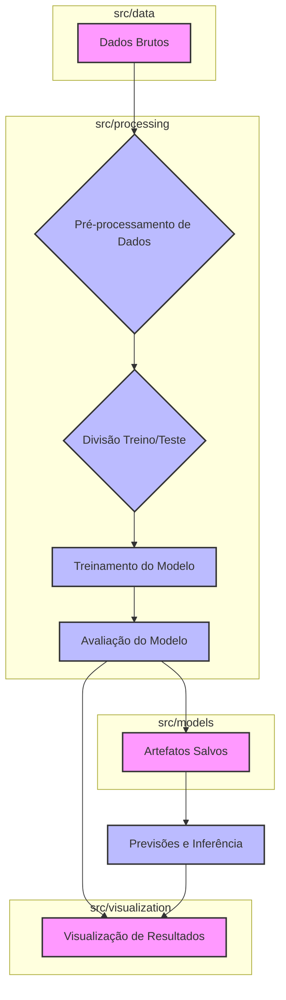

```mermaid
graph TD
    A[Dados Brutos] --> B{Pré-processamento de Dados}
    B --> C{Divisão Treino/Teste}
    C --> D[Treinamento do Modelo]
    D --> E[Avaliação do Modelo]
    E --> F[Artefatos Salvos]
    F --> G[Previsões e Inferência]

    subgraph "src/data"
        A
    end

    subgraph "src/processing"
        B
        C
        D
        E
    end

    subgraph "src/models"
        F
    end

    subgraph "src/visualization"
        H[Visualização de Resultados]
    end

    E --> H
    G --> H

    style A fill:#f9f,stroke:#333,stroke-width:2px
    style B fill:#bbf,stroke:#333,stroke-width:2px
    style C fill:#bbf,stroke:#333,stroke-width:2px
    style D fill:#bbf,stroke:#333,stroke-width:2px
    style E fill:#bbf,stroke:#333,stroke-width:2px
    style F fill:#f9f,stroke:#333,stroke-width:2px
    style G fill:#bbf,stroke:#333,stroke-width:2px
    style H fill:#f9f,stroke:#333,stroke-width:2px
```
